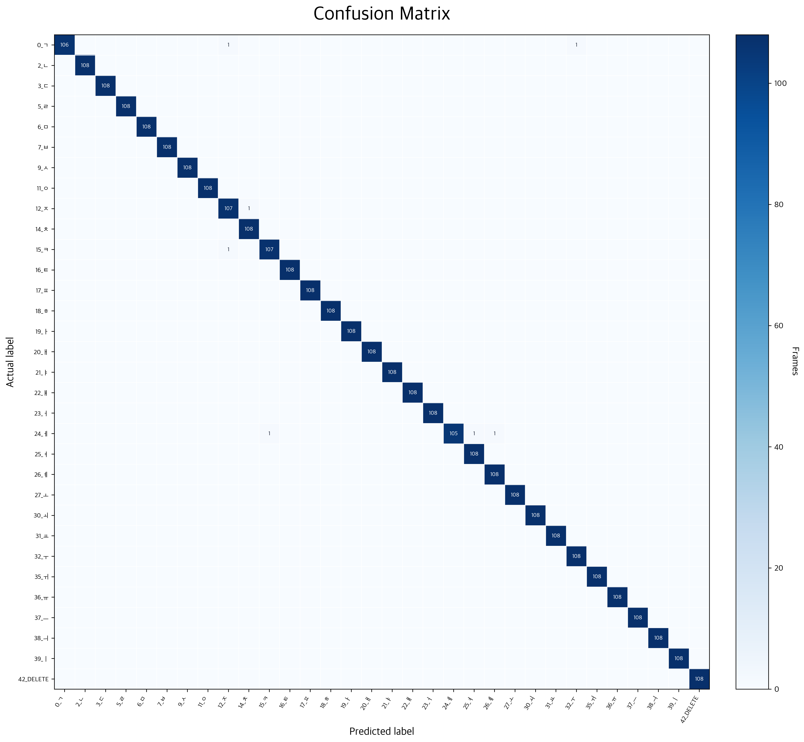
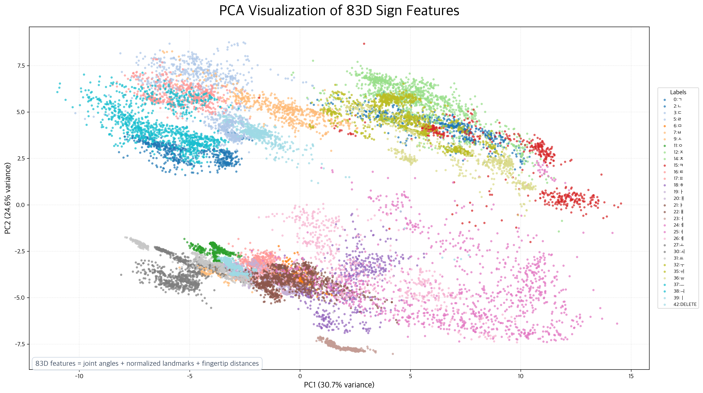

# Static Sign Language Recognition MVP

> MediaPipe Hands와 SVM을 이용해 정적 수화 자모를 인식하고, 한글 텍스트 자막으로 변환하는 실시간 웹 MVP


## Overview

이 프로젝트는 수어 사용자와 비수어 사용자 사이의 소통 장벽을 낮추기 위한 정적 수화 인식 MVP입니다.
브라우저 웹캠에서 손 랜드마크를 추출하고, 백엔드의 SVM 모델이 자음/모음 손모양을 분류한 뒤,
입력된 자모를 한글로 조합해 실시간 자막처럼 보여줍니다.

현재 범위는 **정적 수화 자모 인식**입니다. 동적 수어와 실제 WebRTC 영상통화는 후속 확장 범위입니다.

## Key Features

- MediaPipe Hands 기반 21개 손 랜드마크 추출
- 83차원 feature vector 기반 정적 수화 분류
- `StandardScaler + SVC(RBF)` 기반 SVM 모델
- 오른손 기준 자모/DELETE 입력
- 양손 `START`, `END` 제어 자세
- 한글 자모 조합 및 실시간 자막 UI
- FastAPI inference API
- WebSocket 기반 방 코드 자막 공유
- 수어 사용자 / 비수어 사용자 역할 선택
- 비수어 사용자용 STT 중심 화면

## Demo Preview

> 최종 시연 영상은 발표 전 녹화 후 추가 예정입니다. 현재 README에는 모델 성능과 feature 분포 시각화를 포함했습니다.

| Confusion Matrix | PCA Feature Space |
| --- | --- |
|  |  |

## Model Performance

| Metric | Value |
| --- | ---: |
| Accuracy | **99.80%** |
| Macro F1-score | **99.80%** |
| Mean confidence | **98.05%** |
| Average inference time | **0.529 ms/frame** |
| Test frames | **3,456** |
| Labels | **32** |
| Feature dimension | **83** |

Average inference time 기준으로, 30 FPS의 프레임 budget은 약 33.3ms입니다.
현재 SVM 추론은 평균 0.529ms/frame으로 30 FPS budget의 약 1.6%만 사용합니다.

## Architecture

```text
Browser
  ├─ Webcam
  ├─ MediaPipe Hands
  ├─ 21 hand landmarks
  └─ Frontend caption UI
        │
        │ POST /api/predict
        ▼
FastAPI Backend
  ├─ Landmark validation
  ├─ 83D feature extraction
  ├─ SVM inference
  ├─ Runtime state control
  ├─ Hangul composition
  └─ WebSocket caption broadcast
```

## Project Structure

```text
.
├── AI/
│   ├── models/                 # trained SVM model
│   ├── reports/metrics/        # evaluation reports and visualizations
│   ├── src/sign_language/      # feature extraction, composer, runtime logic
│   ├── tests/
│   ├── train_model.py
│   ├── real_time_recognition.py
│   └── evaluate_webcam.py
├── backend/
│   ├── main.py                 # FastAPI app
│   └── tests/
├── frontend/
│   ├── index.html
│   ├── script.js
│   └── style.css
├── PROJECT_GUIDE.md
├── PROJECT_PRESENTATION_NOTES.md
└── requirements.txt
```

## Quick Start

### 1. Install dependencies

```bash
python3 -m pip install -r requirements.txt
```

### 2. Run web server

```bash
python3.8 -m uvicorn backend.main:app --host 127.0.0.1 --port 8000
```

Open:

```text
http://localhost:8000
```

### 3. Same Wi-Fi test

```bash
python3.8 -m uvicorn backend.main:app --host 0.0.0.0 --port 8000
```

다른 기기에서 접속:

```text
http://<server-ip>:8000
```

브라우저 카메라는 보안 정책상 `localhost` 또는 `HTTPS`에서만 안정적으로 허용됩니다.
IP 주소로 접속할 경우 방 입장과 WebSocket은 되지만 카메라가 차단될 수 있습니다.

## Input Flow

```text
양손 펼친손 START
  → 오른손 자음/모음 입력
  → 필요 시 DELETE
  → 양손 주먹 END
  → 한글 텍스트 출력
```

쌍자음과 겹모음은 별도 클래스로 수집하지 않고 조합 규칙으로 처리합니다.

```text
ㅅ + ㅅ + ㅏ → 싸
ㅇ + ㅗ + ㅏ → 와
ㅇ + ㅜ + ㅔ → 웨
```

## API Overview

| Method | Endpoint | Description |
| --- | --- | --- |
| `GET` | `/api/health` | 서버와 모델 로드 상태 확인 |
| `GET` | `/api/config` | 라벨, 제어 라벨, feature dimension 조회 |
| `POST` | `/api/predict` | 손 랜드마크 기반 수어 예측 |
| `POST` | `/api/reset` | 입력 세션 초기화 |
| `WS` | `/ws/{room_code}/{nickname}` | 같은 방 사용자 간 자막/상태 공유 |

프론트엔드는 영상 원본을 전송하지 않고 MediaPipe Hands의 랜드마크 좌표와 handedness만 백엔드로 보냅니다.

## Dataset & Model Policy

- GitHub에는 실행 가능한 학습 완료 모델을 포함합니다.
- 전체 원본 학습 데이터는 용량과 관리 문제 때문에 GitHub에 포함하지 않습니다.
- 재학습이 필요하면 Google Drive에서 팀 데이터셋을 내려받아 `AI/dataset/features/`에 배치합니다.
- 모델과 성능 산출물은 `AI/reports/metrics/`에서 확인할 수 있습니다.

```bash
python3.8 AI/train_model.py
```

## Verification

```bash
python3.8 -m pytest AI/tests backend/tests
node --check frontend/script.js
```

현재 검증 결과:

- `pytest`: 23 passed
- `node --check`: passed
- 주요 Python 파일 syntax check: passed

## Team

| Name | Role |
| --- | --- |
| 김강우 | Team Lead, ML model, data management, QA |
| 최희태 | Backend |
| 김정효 | Frontend |
| 김영래 | Backend |

## Documentation

- [Project Guide](PROJECT_GUIDE.md): 실행 방법, UI 사용법, 디버깅, 데이터 구조
- [Presentation Notes](PROJECT_PRESENTATION_NOTES.md): PPT 제작용 문제 정의, 데이터, 모델, 평가 정리
- [Frontend Change Note](frontend/FRONTEND_CHANGE_NOTE.md): 프론트엔드 변경 기록

## License

Source code is licensed under the Apache License 2.0.
Dataset, trained model, and data-derived artifacts are for non-commercial project use unless separately permitted by the project team.
